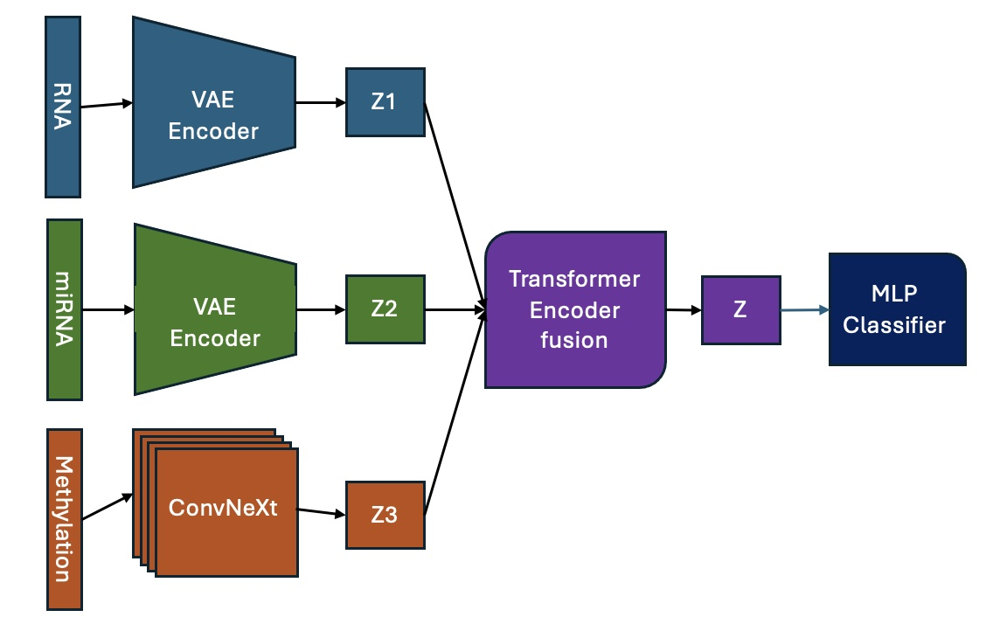

# Breast Cancer Subtype Prediction

<figure>
  
  <figcaption style="text-align:center; font-style:italic;">Multi-Omics Data Integeration</figcaption>
</figure>

## 🧠 Model Overview: `MultiOmicsClassifier`

The `MultiOmicsClassifier` is a modular deep learning architecture designed for multi-omics breast cancer subtype classification using RNA-seq, microRNA, and DNA methylation data. It combines modality-specific encoders, a Transformer-based fusion mechanism, and a classification head optimized with focal loss.

### 🔍 Architecture Components

#### 🧬 Methylation Encoder (`MiniConvNeXtMethylation`)
- Based on a lightweight ConvNeXt design
- Two ConvNeXt blocks with:
  - Depthwise convolution (kernel size 7×7, group=channel)
  - LayerNorm + 2-layer MLP (32 → 128 → 32)
- Adaptive average pooling
- Final projection: `Linear(32 → 128)`

#### 🧬 RNA-seq & microRNA Encoders (`VAEEncoder`)
- Input dims:
  - RNA-seq: 13,054
  - microRNA: 1,046
- Hidden layers: `[1024, 512]`
- Latent dimension: `128`
- Output: latent vector, μ, and logσ²

#### 🔁 Fusion Module (`MultimodalFusion`)
- Learned positional embedding for 3 modalities
- Single-layer Transformer Encoder with:
  - Multi-head self-attention
  - Feedforward dim: `512`
  - Dropout: `0.1`
- Output fused via `AdaptiveAvgPool1d → (B, D)`

#### 📏 Normalization
- LayerNorm applied:
  - After each encoder
  - After fusion output (before classification)

#### 🎯 MLP Classifier
- Linear(128 → 128) → ReLU → Dropout(0.3) → Linear(128 → 5)

- Outputs logits for 5 breast cancer subtypes:
  - Luminal A, Luminal B, Normal-like, Basal-like, HER2-enriched

---

### ⚙️ Training
- Optimized end-to-end with **focal loss** to address class imbalance
- Hyperparameters:
  - Latent dimension, β for KL loss, γ for focal loss
  - Label smoothing and class weighting
  - Learning rate, weight decay

---
